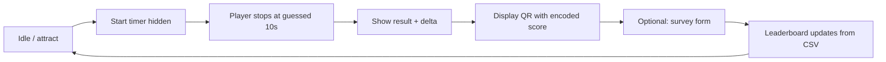

# Game Design: Marketing Time Challenge (Working Title)

**Version:** 1.0  
**Context:** Trade fair / Messe kiosk — fullscreen browser, local timing, lead capture via QR.  
**Brand:** Align with [Salesfive](https://www.salesfive.com) corporate identity (logo, typography, colors — use official assets in production).

---

## 1. Elevator pitch

Visitors try to **stop a hidden timer as close as possible to exactly 10.00 seconds** using a single “buzzer” action. Their **error in milliseconds** becomes their score (lower is better). After the round, a **QR code** sends them to a short form; the **result is pre-filled from the URL** so they only add contact details. A **leaderboard** on the same web app builds social proof and repeat plays.

---

## 2. Why this mechanic (trend check)

The “stop at 10 seconds” challenge has appeared repeatedly in **social and experiential marketing**:

- **Restaurant / viral promos:** Venues invite guests to stop a timer at 10 seconds for prizes; the format drives shares and foot traffic (e.g. widely discussed Instagram/TikTok cases around “10 second game” promos).
- **Productized format:** [CW&T’s 10 Second Stopwatch Game](https://cwandt.com/products/10-second-stopwatch-game) popularized “internal clock” play with eyes closed and a physical button — same psychological hook: **no visible countdown**, only one’s sense of time.
- **Hardware variants:** LED “challenge timers” and countdown devices are sold for promotions and events, which confirms **event suitability** beyond pure app-based play.

**Design takeaway for Messe:** The mechanic is **instantly explainable**, **watchable** (crowd gathers around the screen), and **shareable** (QR + leaderboard). It fits a **short dwell time** at a booth.

---

## 3. Design pillars

| Pillar | Intent |
|--------|--------|
| **Fair & offline-first** | Timer runs **locally in the browser** so Messe Wi‑Fi load and latency do not affect the result. |
| **One action, one goal** | Start/stop is a **single primary control** — a **physical USB buzzer** (see §7a); no settings maze on the kiosk. |
| **Trust the number** | Show **elapsed time and delta from 10.000s** clearly after the stop — transparency reduces disputes. |
| **Lead capture without friction** | QR carries **`time` (or derived score)** in the query string; form is **name, email, nickname** only. |
| **Brand-forward** | Visual language follows **Salesfive** site: confident, clean B2B, **digital transformation / Salesforce & AI** adjacency without cluttering the game UI. |

---

## 4. Target audience & session profile

- **Primary:** Trade fair attendees (mixed technical and business roles), often in a hurry.
- **Session length:** ~20–60 seconds play + optional ~30–90 seconds for QR + form.
- **Skill floor:** Anyone can play once; **replay** is encouraged to beat one’s own delta.

---

## 5. Core loop

1. **Attract:** Fullscreen branded screen + short “Stop at 10.000s” copy + buzzer.
2. **Run:** On start, **no visible countdown** (optional: Messe build may show a “go” flash only — configurable). Timer starts **monotonically** from 0 in code.
3. **Stop:** First stop locks the round; compute **delta = \|elapsed − 10s\|** (see scoring).
4. **Reveal:** Show actual elapsed (e.g. `10.047s`) and delta (`47 ms off`).
5. **QR:** Encode parameters for `survey?time=…` (see §9).
6. **Leaderboard:** Read from **simple CSV** on server; display top N; optional refresh interval.

---

## 6. Rules & scoring

- **Target:** 10.000 seconds (10s) wall-clock as measured **client-side** (`performance.now()` or equivalent high-resolution clock).
- **Score for ranking:** Recommend **absolute error in milliseconds:**  
  `score_ms = round(|elapsed_ms − 10000|)`  
  Lower is better. Ties: earlier submission time or smaller raw elapsed below/above 10s — **pick one rule and document it in UI footnotes**.
- **Invalid actions:** Double-tap before start = ignore second tap; after stop, require explicit **“Play again”** to avoid accidental restarts.
- **Optional Messe rule:** “Best of 3” is a **mode** for quieter periods — not required for v1.

**CW&T-style variant (optional future):** “Price Is Right” rule — only counts if **not over** 10s. That increases rules explanation cost; **default for Messe: symmetric distance** (simpler for international audience).

---

## 7. UX states (kiosk)

| State | Purpose |
|-------|---------|
| **Attract** | Brand, one-line rules, large buzzer |
| **Running** | Hidden timer; optional subtle animation (pulse) — **no digits** |
| **Result** | Big delta + raw time; CTA “Scan to register” |
| **QR** | Large QR, short URL text, privacy hint |
| **Leaderboard** | Fullscreen or slide; top 10–20; Salesfive styling |

**Accessibility:** High contrast, large on-screen affordance matching the physical buzzer, **no reliance on color alone** for success (use icons + text).

---

## 7a. Physical buzzer (USB)

At the Messe booth the player uses a **real buzzer** plugged in via **USB**. These devices usually present as a standard **HID keyboard** and send a key press when pressed — often **`Space`**, sometimes **`Enter`**, depending on firmware or dip switches.

| Topic | Guidance |
|-------|----------|
| **Implementation** | Treat the game as **keyboard-driven**: listen for `keydown` (and optionally `keyup` if debouncing) on **`Space`** and **`Enter`**, and map both to the same “buzzer” action so either mapping works. |
| **Focus** | The game page must **keep keyboard focus** in the play area (e.g. a focused root element or `document` handler) so the USB buzzer always reaches the app — avoid trapping focus inside the QR or leaderboard-only views without a way to buzz. |
| **Repeat / chatter** | Guard against **key repeat** (OS-held key) if the device fires repeats: only the **first** press in **Running** should stop the timer; ignore repeats until the next round. |
| **Touch fallback** | On-screen button remains useful for staff demos or if USB is unplugged; it should mirror the same code path as Space/Enter. |
| **Verification** | Before the event, plug in the exact hardware and confirm which key(s) it sends (e.g. in a simple keycode tester or browser devtools). |

---

## 8. Technical constraints (from product brief)

| Requirement | Implication |
|-------------|-------------|
| Everything on **one web server** | Static + minimal backend for CSV and routes. |
| **Endpoints:** `game` and `survey?time=13`** | QR must use agreed query param (`time`); value should carry **precomputed score or raw ms** — team must align encoding (see §9). |
| **Leaderboard = CSV** | Periodic write from form handler; read on `game` view; **file locking** or atomic writes if concurrent. |
| **Timing local** | No server round-trip for start/stop; server only sees outcome **after** QR/form. |
| **USB buzzer** | Input is **keyboard events** (Space / Enter); see §7a — no custom driver required in the browser. |

---

## 9. QR & survey payload

- **Flow:** Game encodes result into URL, e.g. `https://<host>/survey?time=47` where `47` means **47 ms error** (or raw elapsed in ms — **must be consistent** in implementation).
- **Form fields:** Name, email, nickname (from readme); **best time / delta auto from query**.
- **Validation:** Email format; name length caps; **GDPR:** link to privacy policy on form.

---

## 10. Art & motion direction (Salesfive-aligned)

- **Tone:** Professional, approachable, **“Digitalize processes. Leverage data.”** energy — not arcade-neon unless Salesfive campaign says otherwise.
- **Layout:** Generous whitespace, **one focal column** on ultra-wide kiosk screens.
- **Motion:** Short ease on result reveal; avoid distracting loops during the hidden-timer phase.

**Production assets:** Replace placeholders under `content/images/` with **official Salesfive** logo, color tokens, and fonts from brand guidelines.

---

## 11. Content manifest (required images)

All paths relative to project root. **Placeholders** ship as SVG; swap for PNG/WebP from design if needed.

| File | Role |
|------|------|
| `content/images/logo-placeholder.svg` | Until official logo is dropped in |
| `content/images/icon-timer.svg` | Timer / challenge icon for UI and docs |
| `content/images/icon-buzzer.svg` | Primary action affordance |
| `content/images/bg-mesh.svg` | Subtle fullscreen background |
| `content/images/illustration-qr-flow.svg` | Start → stop → QR narrative for slides or idle screen |

---

## 12. Audio (optional v1)

- **Start:** soft click; **stop:** satisfying thunk; **result:** subtle whoosh.  
- Default **off** if Messe floor is noisy; **on** with volume control** in staff settings.

---

## 13. Risks & mitigations

| Risk | Mitigation |
|------|------------|
| **Clock skew / tab background** | Use high-resolution timer; warn if tab loses focus (optional). |
| **CSV corruption** | Atomic writes; backup file rotation. |
| **QR typo** | Short domain; test print size at booth distance. |
| **Wrong key / no input** | Pre-flight hardware test; visible hint “Buzzer = Space” if staff confirms mapping. |

---

## 14. Open decisions (for implementation)

- Exact **query param semantics** for `time=` (delta ms vs elapsed ms).
- **Leaderboard** sort and tie-breakers; whether to show **nickname only** publicly.
- **English vs German** copy for international fairs (readme is German; Salesfive site is bilingual).
- Confirm **actual keycode** from the purchased USB buzzer (Space vs Enter vs other) and whether **key repeat** occurs.

---

## References

- [Salesfive — homepage](https://www.salesfive.com) (brand, services, events)
- [CW&T — 10 Second Stopwatch Game](https://cwandt.com/products/10-second-stopwatch-game) (reference rules for physical format)
- Social/venue “10 second challenge” promos (e.g. restaurant viral cases on Instagram/TikTok — search “10 second timer challenge restaurant”) for marketing parallels
